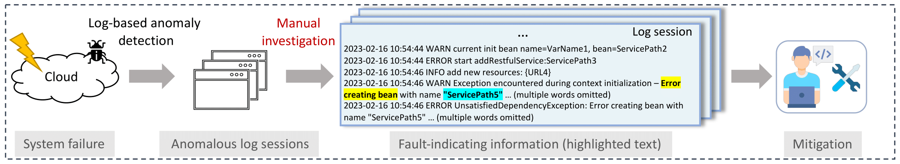

# LoFI: Extracting Fault-indicating Information from Logs via Prompt-based Tuning

This is the anonymous repository for the ASE 2023 submission **#225 "LoFI: Extracting Fault-indicating Information from Logs via Prompt-based Tuning"**. 
In this paper, we propose an automated approach to extract fault-indicating information from logs.



## Repository Structure
```
.
├── data
│   ├── datasetB
│   │   ├── train.json
│   │   ├── dev.json
│   │   ├── test.json
├── src
│   ├── pipeline.py
│   ├── config
│   │   ├── config.py
│   ├── preprocessing
│   │   ├── preprocessing.py
│   ├── log_selection
│   │   ├── selection_strategy.py
│   │   ├── textual_encoding.py
│   │   ├── textual_similarity.py
│   ├── llm_inference
│   │   ├── run_qa.py
│   │   ├── args.py
│   │   ├── dataset.py
│   │   ├── trainer_qa.py
│   │   ├── utils_qa.py
│   ├── evaluation
│   │   ├── evaluate.py
│   │   ├── my_squad_v2.py
│   │   ├── my_evaluator.py
│   ├── prerained_models
│   │   ├── roberta-base
│   │   │   ├── download.sh 
```

## Quick Start
- Install Requirements

```
conda create -n lofi python=3.9
conda activate lofi
pip install -r requirements.txt
```

- Download Pretrained Language Models

```
cd src/pretrained_models/roberta-base
bash download.sh
```

- Run Pipeline Stage 1: Log Selection 
```
cd src
python pipeline.py --log_selection
```

- Run Pipeline Stage 2: PLM Training and Inference
```
cd src
python pipeline.py --do_extraction --num_train_epochs 100
```


